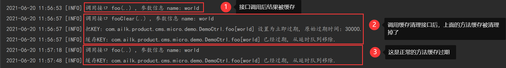

# 简介说明
​	扩展Spring Cache，提供灵活的方法缓存过期策略，Spring只提供缓存方案未提供设置缓存的过期策略。


# 快速入门

## 方法缓存

```java
@Api(description = "一个demo例子")
@RestController
@Slf4j
public class DemoCtrl {

  @ApiOperation("一个测试接口")
  @Cacheable(value = "default", keyGenerator = "apiKeyGenerator")
  @Expiry(time = 30, unit = TimeUnit.SECONDS, methodKey = "foo")
  @RequestMapping(path = "/foo/", method = RequestMethod.GET, produces = MediaType.APPLICATION_JSON_UTF8_VALUE)
  @ResponseBody
  public Map foo(@RequestParam(name = "name", defaultValue = "world") String name) {
    log.info("调用接口 foo(..) , 参数信息 name: {}", name);
    return ImmutableMap.of("msg", String.format("hello %s", name), "time",
        FormatTime.YYYYMMDDHHMISS.withMills(System.currentTimeMillis()));
  }

  @ApiOperation("清理接口缓存")
  @CacheEvict(value = "default", keyGenerator = "apiKeyGenerator")
  @Expiry(methodKey = "foo")
  @RequestMapping(path = "/foo/", method = RequestMethod.DELETE)
  public void fooClear(@RequestParam(name = "name", defaultValue = "world") String name) {
    log.info("调用接口 fooClear(..) , 参数信息 name: {}", name);
  }
}
```





## 如何启用?

```java
@EnableCaching
@SpringBootApplication
public class App {

  public static void main(String[] args) {
    SpringApplication.run(App.class, args);
  }

}
```


```java
@Configuration
public class Config {
	
    
	// 方法缓存Key生成策略
    @Bean
    public KeyGenerator apiKeyGenerator() {
        return new ParamsKeyGenerator();
    }
    
    // 默认缓存策略
    // 基于LinkedHashMap+DelayQueue实现,无需依赖第三方缓存中间件
    @Bean
    CacheConfig apiCacheConfig() {
        return new CacheConfig();
    }
}
```


## 其他策略


```Java
// 使用memcached作为缓存
@Bean
public CacheManager cacheManager () throws Exception {
   return new CacheConfig(){
   	    protected Collection<Cache> buildCaches(){
            MemcachedCacheFactoryBean factoryBean = new MemcachedCacheFactoryBean();
            factoryBean.setPoolConfig(new PoolConfiguration("192.168.56.201:11201"));
            factoryBean.afterPropertiesSet();
            MemCachedClient client = factoryBean.getObject();
            MemcachedCache cache = new MemcachedCache(client);
            return ImmutableList.of(cache);
   	    }
   };
}
  
// 使用redis作为缓存
@Bean
public CacheManager cacheManager () throws Exception {
    return new CacheConfig(){
        protected Collection<Cache> buildCaches(){
            RedisFactoryBean factoryBean = new RedisFactoryBean();
            factoryBean.setRedisUri("redis://192.168.56.201:6379/1");
            factoryBean.setUseBinary(true);
            factoryBean.afterPropertiesSet();
            StatefulRedisConnection nativeRedis = factoryBean.getObject();
            RedisCache cache=new RedisCache(nativeRedis);
            return ImmutableList.of(cache);
        }
    };
}
```


# 注意事项

1. 需要做缓存的方法声明

   ```java
   @Cacheable(value = "default", keyGenerator = "apiKeyGenerator")
   @Expiry(time = 30, unit = TimeUnit.SECONDS, methodKey = "foo")
   ```

2. 清理缓存的方法声明

   ```java
   @CacheEvict(value = "default", keyGenerator = "apiKeyGenerator")
   @Expiry(methodKey = "foo")
   ```

3. 缓存方法的methodKey和清理缓存的methodKey必须一致


# 实际例子

以下提供了一个是实际的[springboot应用demo](https://pan.baidu.com/s/19J4J63ThS07N1mvKmW2Ixg) 提取码:xjpm

其中memcached相关依赖从下面获取

[github](https://github.com/downloads/gwhalin/Memcached-Java-Client/java_memcached-release_2.6.1.zip) 、[百度网盘 ](https://pan.baidu.com/s/1VgYl3_SpCpIf-HJ7-mMhaQ)提取码:2upn


# FAQ

jun3.yuan@gmail.com